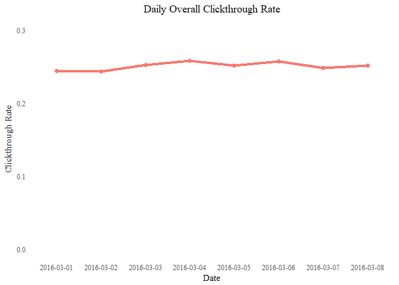
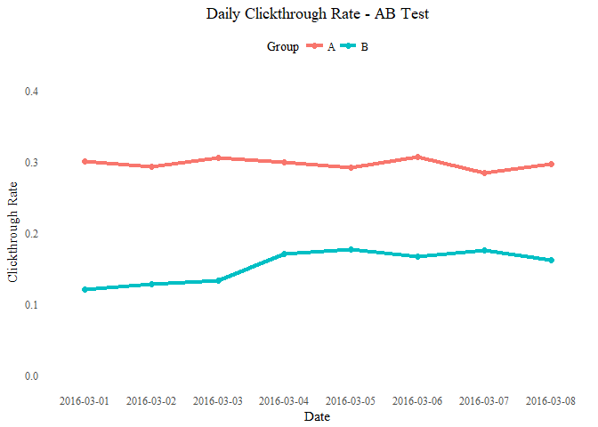
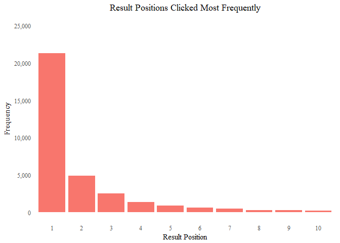
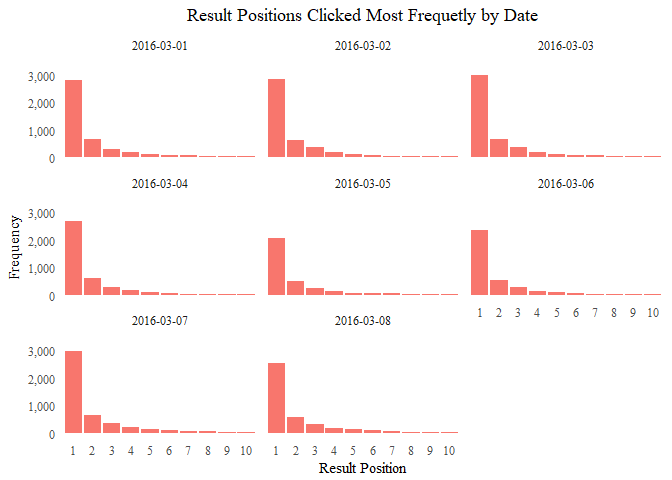
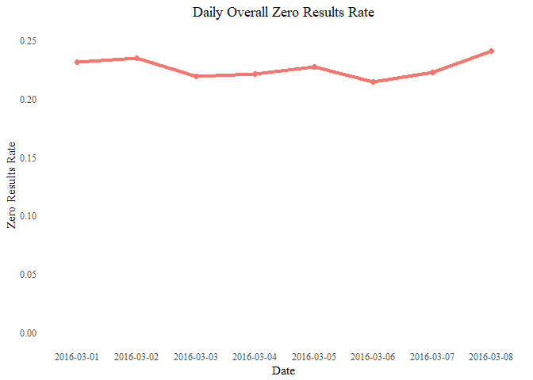
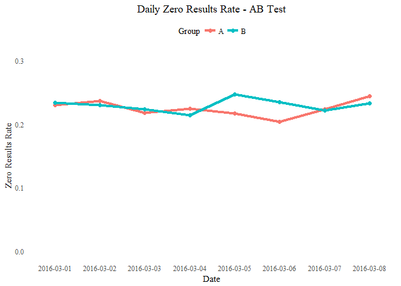
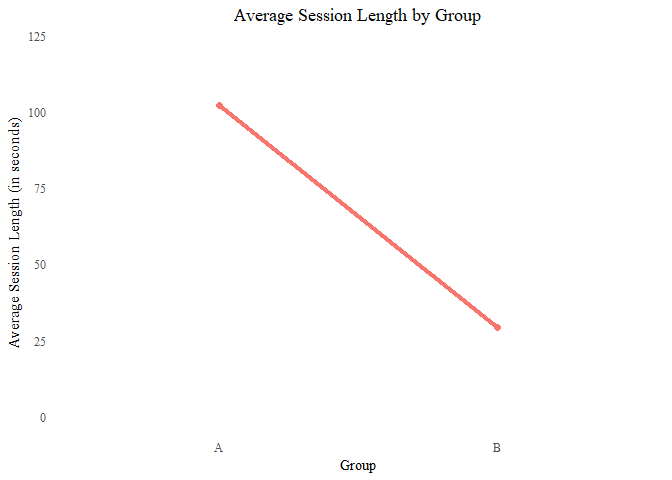

# Wikimedia Clickthrough Analysis
Author: Jim Neville
Date: 5/20/18


## Executive Summary

The event logs contained in `events_log.csv` include data regarding Wikimedia Searches from 3/1/16 through 3/8/16. The data suggest that the treatment in Group A tends to coincide with a greater average clickthrough rate, as well as a longer average session length. Additionally, it appears that the differences between the  Group A and Group B treatments had no significant effect on the zero results rate.


### Daily Overall Clickthrough Rate

The overall clickthrough rate remained steady over this period. The minimum clickthrough rate (24.31%) was recorded on 3/2/18, while the maximum clickthrough rate (25.75%) was recorded on 3/4/18. 


<!-- -->


### Daily Clickthrough Rate - AB Test

Over this period, it is clear that the Group A treatment led to a much greater clickthrough rate compared with the Group B treatment. The Group A treatment had a maximum clickthrough rate of 30.62% and a minimum clickthrough rate of 28.43%, while the Group B treatment had a maximum clickthrough rate of 17.64% and a minimum clickthrough rate of 12.05%. Moreover, a paired t-test revealed a statistically significant difference between the two treatment groups (t = 15.41, p < 0.01).


<!-- -->


```
##    estimate statistic      p.value parameter  conf.low conf.high
## 1 0.1430851  15.41344 5.837149e-07         7 0.1152547       Inf
##          method alternative
## 1 Paired t-test     greater
```


### Results Users Try First

Overall, the majority of all searches (53%) result in the user visiting the webpage listed first in the search results, with the liklihood that the user will click on the result decreasing as the result positiion moves farther away from 1. 

<!-- -->

This trend remained steady over the 8-day period from 3/1/16 to 3/8/16.

<!-- -->

### Daily Overall Zero Results Rate

The Daily Overall Zero Results Rate remained faily steady over this time period, with the maximum Zero Results Rate (24.03%) occuring on 3/8/18 and the minimum Zero Results Rate (21.38%) occuring on 3/6/18.


<!-- -->

### Daily Zero Results Rate - AB Test

The Daily Zero Results Rate does not appear to vary a great deal between the group treatments. Moreover a one-tailed paired t-test revealed that there is not a statistically significant difference between the Zero Results Rate for the two treatment groups (t = -0.86, p = 0.21) 


<!-- -->


```
##       estimate  statistic   p.value parameter conf.low   conf.high
## 1 -0.005055333 -0.8649976 0.2078485         7     -Inf 0.006017214
##          method alternative
## 1 Paired t-test        less
```

### Session Length

The searches in the Group A treatment had a mean session length of 102 seconds, while the Group B treatment's mean was much less at 29.1 seconds.


<!-- -->

